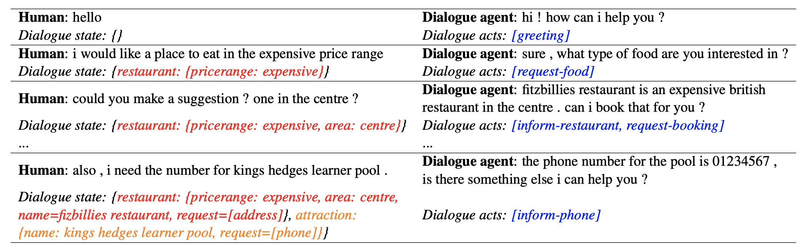
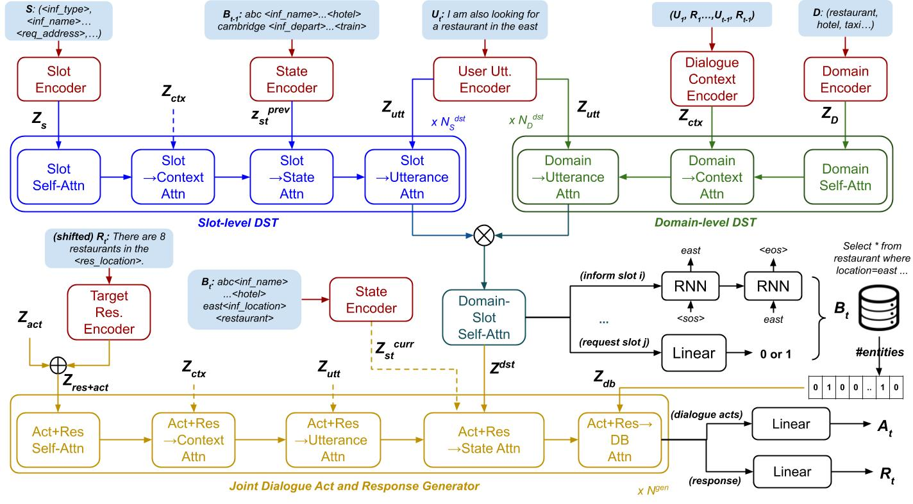

Conv: A Unified Conversational Neural Architecture for Multi-domain Task-oriented Dialogues
 

This is the PyTorch implementation of the paper:
**[UniConv: A Unified Conversational Neural Architecture for Multi-domain Task-oriented Dialogues](https://arxiv.org/abs/2004.14307)**. [**Hung Le**](https://github.com/henryhungle), [Doyen Sahoo](https://scholar.google.com/citations?hl=en&user=A61jJD4AAAAJ), [ChenghaoLiu](https://scholar.google.com.sg/citations?user=OvwvSXwAAAAJ&hl=en), [Nancy F. Chen](https://sites.google.com/site/nancyfchen/bio), [Steven C.H. Hoi](https://sites.google.com/view/stevenhoi/). [**EMNLP 2020**](https://2020.emnlp.org/).) ([arxiv](https://arxiv.org/abs/2004.14307), [camera-ready version](https://www.aclweb.org/anthology/2020.emnlp-main.146/))

This code has been written using PyTorch 1.0.1. If you find the paper or the source code useful to your projects, please cite the following [bibtex](https://www.aclweb.org/anthology/2020.emnlp-main.146.bib): 
<pre>
@inproceedings{le-etal-2020-uniconv,
    title = "{U}ni{C}onv: A Unified Conversational Neural Architecture for Multi-domain Task-oriented Dialogues",
    author = "Le, Hung  and
      Sahoo, Doyen  and
      Liu, Chenghao  and
      Chen, Nancy  and
      Hoi, Steven C.H.",
    booktitle = "Proceedings of the 2020 Conference on Empirical Methods in Natural Language Processing (EMNLP)",
    month = nov,
    year = "2020",
    address = "Online",
    publisher = "Association for Computational Linguistics",
    url = "https://www.aclweb.org/anthology/2020.emnlp-main.146",
    pages = "1860--1877"
}
</pre>

## Abstract
Building an end-to-end conversational agent for multi-domain task-oriented dialogue has been an open challenge for two main reasons. First, tracking dialogue states of multiple domains is non-trivial as the dialogue agent must obtain complete states from all relevant domains, some of which might have shared slots among domains as well as unique slots specifically for one domain only. Second, the dialogue agent must also process various types of information across domains, including dialogue context, dialogue states, and database, to generate natural responses to users. Unlike the existing approaches that are often designed to train each module separately, we propose “UniConv" — a novel unified neural architecture for end-to-end conversational systems in multi-domain task-oriented dialogues, which is designed to jointly train (i) a Bi-level State Tracker which tracks dialogue states by learning signals at both slot and domain level independently, and (ii) a Joint Dialogue Act and Response Generator which incorporates information from various input components and models dialogue acts and target responses simultaneously. We conduct comprehensive experiments in dialogue state tracking, contextto-text, and end-to-end settings on the MultiWOZ2.1 benchmark, achieving superior performance over competitive baselines in all tasks.

  
 Example of a multi-domain dialogue with two domains: restaurant and attraction

## Model Architecture

Our unified architecture has three components: (1) Encoders encode all text input into continuous representations; (2) Bi-level State Tracker (BDST) includes 2 modules for slot-level and domain-level representation learning; and (3) Joint Dialogue Act and Response Generator (DARG)obtains dependencies between the target response representations and other dialogue components.

## Setup
Libraries required for this repo are listed in the `requirements.txt`. An example script to install these libraries is made in the `setup.sh` file. 

## Dataset

We use the MultiWOZ benchmark, including both version 2.0 and 2.1. Download the data [here](https://drive.google.com/file/d/1_cFK4d10NQxDNZPM9OrH6mkGuQlnEoWw/view) and unzip into the root directory of the repo e.g. `UniConv/data2.0` and `UniConv/data2.1`.

The data includes the original and pre-processed MultiWOZ dialogues. The preprocessed data are in the `multi-woz` sub-folder in each version and includes the following files:
 - `delex_data.pkl`: delexicalized utterances e.g. replacing real restaurant names to place holder token `restaurant_name` in all utterances
 - `slots.pkl`: gathered domain and slot labels for DST tasks 
 - `dials.pkl`: divided data by data instances, each is a dialogue turn with all annotations of states, acts, database pointers, etc. 
 - `lang.pkl`: collected unique tokens to build vocabulary sets
 - `encoded_data.pkl`: data instances encoded by token indices 

The procedure for data preprocessing is detailed in the `preprocess_data.py` file. 
## Scripts 

We created `run_exps.sh` to train models, generate dialogue states and responses, and evaluating the generated states and responses with automatic metrics. You can directly run this file by following this syntax:

    ./run_exps.sh <setting> <stage>
where `setting` is a specific subtask, either `dst` (dialogue state tracking), `c2t` (context-to-text generation), or `e2e` (end-to-end system). `stage` is from 1 to 3: stage 1 performs all steps, including training, generating, and evaluating, stage 2 performs only generating, and evaluating, and stage 3 performs only evaluating. 

While training, the model with the best validation is saved. The model output, parameters, vocabulary, and training and validation logs will be save into folder determined in the `out_dir` parameter.  

Other parameters, including data-related options, model parameters,  training and generating settings, are defined under the `configs` folder. 

Examples of pretrained UniConv models (DST, context-to-text, and end-to-end models) using the sampled script in `run_exps.sh` can be downloaded here (TBD). Unzip the download file and update the `out_dir` parameter in the generating command (stage 2) in the `run_exps.sh` to the corresponding unzip directory e.g. `save/multiwoz2.1_c2t`. Using the pretrained models, the test script provides the following results in the end-to-end setting: 
(TBD) 

